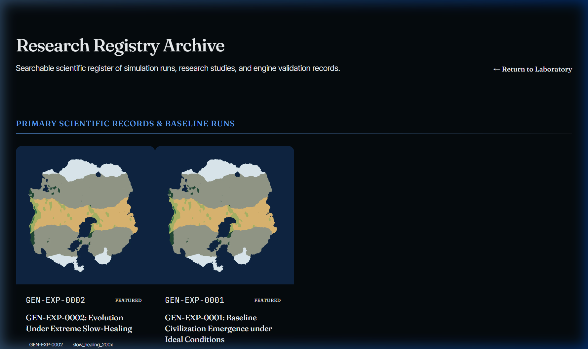
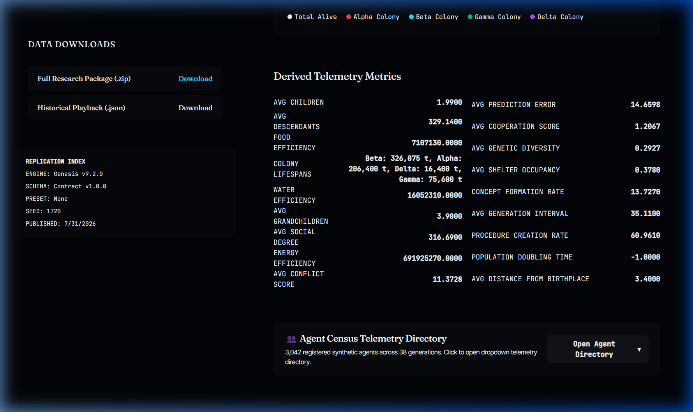

<div align="center">
  
</div>

<p align="center">
  <a href="https://genesis.vinaykhosya.com" target="_blank">
    
  </a>
  <a href="https://vinaykhosya.com" target="_blank">
    
  </a>
  
  
</p>

---

## Overview

**Project Genesis** is a high-resolution simulation engine of artificial life, ecology, natural selection, and emergent cognitive behavior. It models the survival, decision-making, genetic trait expression, resource competition, and evolutionary dynamics of autonomous agents operating within a resource-constrained, dynamic environment.

Designed as an experimental research platform, Genesis enables the study of evolutionary pressure, neural adaptation, metabolic trade-offs, and self-organizing social structures across millions of simulation cycles.

---

## Live Research Portal & Experiment Archive

Real experiments, phylogenetic trees, and telemetry captured from the deployed Genesis platform:

<div align="center">
  
  <p><i>Live Experiment Archive: Multi-agent evolutionary runs across millions of simulation ticks.</i></p>
</div>

<div align="center">
  
  <p><i>Real-time Observatory: Population dynamics, metabolic efficiency, and behavioral divergence curves.</i></p>
</div>

---

## Research Publications & Technical Reports

- **Monograph**: *The Genesis Simulation: Cognitive Emergence and Evolutionary Dynamics in High-Density Agentic Populations*
- **Empirical Report**: *Emergence of Cooperative Swarming and Scarcity Strategies in 3.26M Cycle Multi-Agent Ecosystems*
- **Architecture Spec**: *High-Throughput Discrete Event Simulation for A-Life Systems*

---

## Quickstart

```bash
# Clone the repository
git clone https://github.com/vinaykhosya/project-genesis.git
cd project-genesis

# Install dependencies
pip install -r requirements.txt

# Run standard simulation run
python main.py --config configs/standard_evolution.json

# Launch interactive visualizer
python run.py --visualize
```

---

## Live Web Portal

Explore the web-based telemetry visualizer and civilization replay system at:  
👉 **[https://genesis.vinaykhosya.com](https://genesis.vinaykhosya.com)**

---

<div align="center">
  <p>Engineered by <a href="https://vinaykhosya.com"><b>Vinay Khosya</b></a></p>
  
</div>
